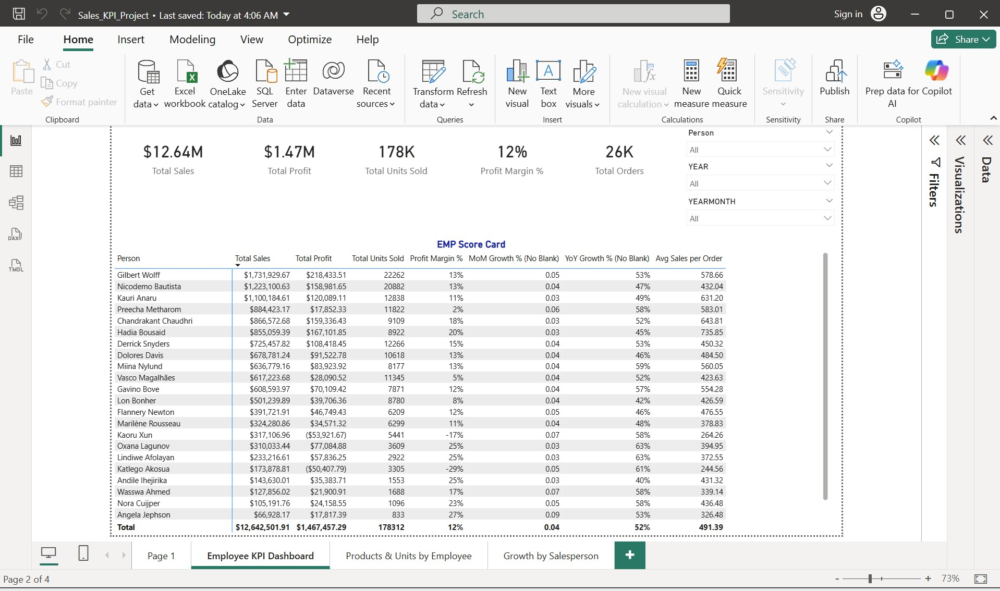
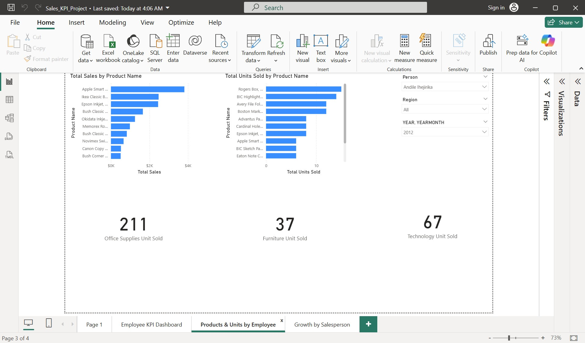
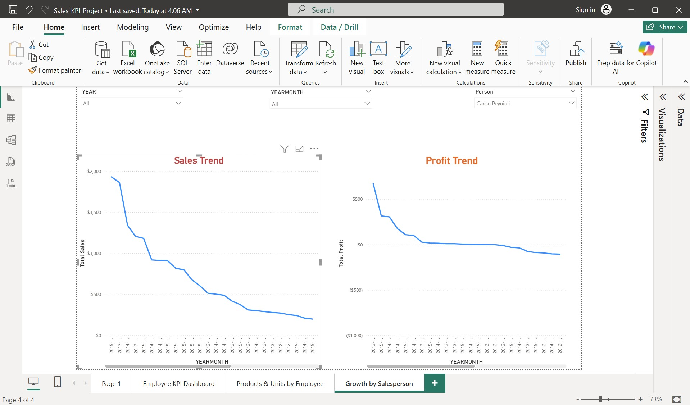
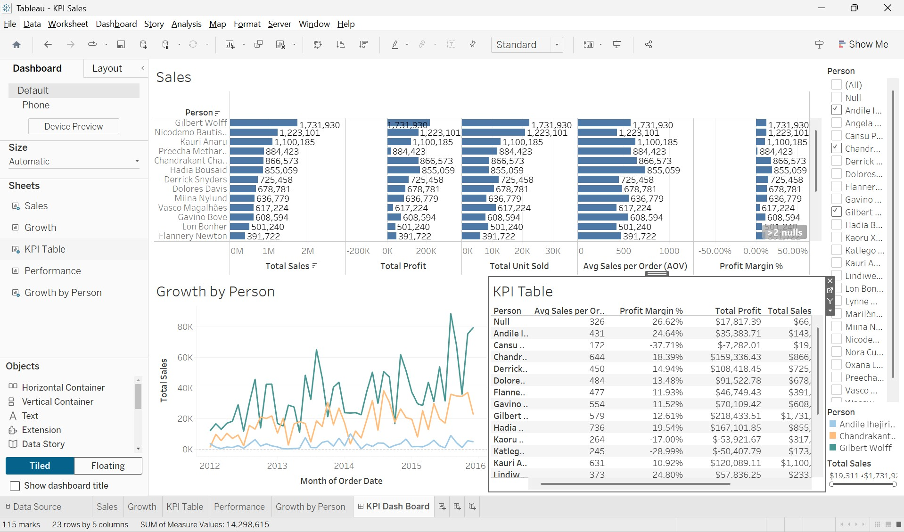
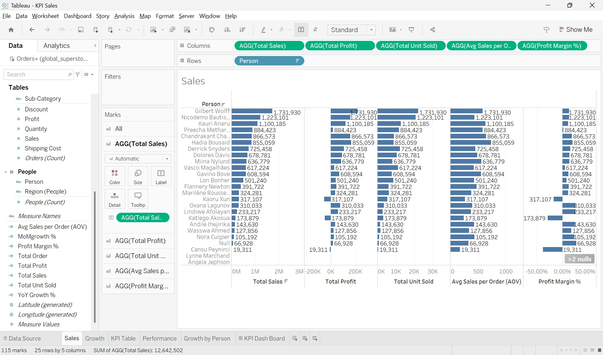
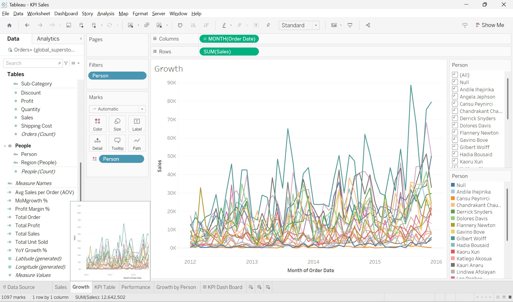
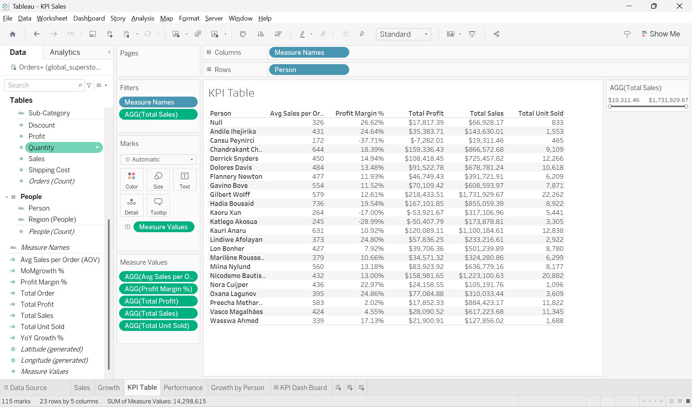
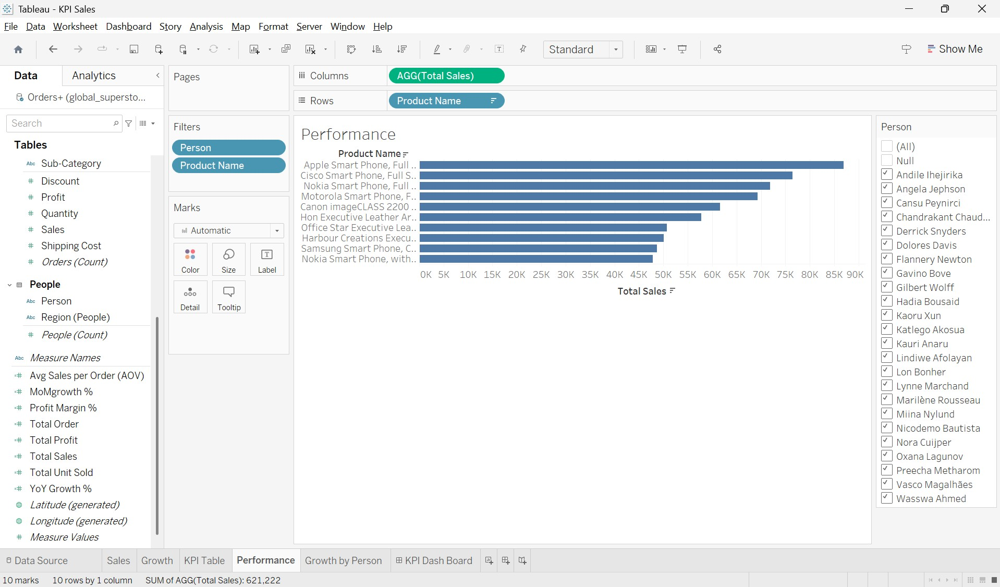
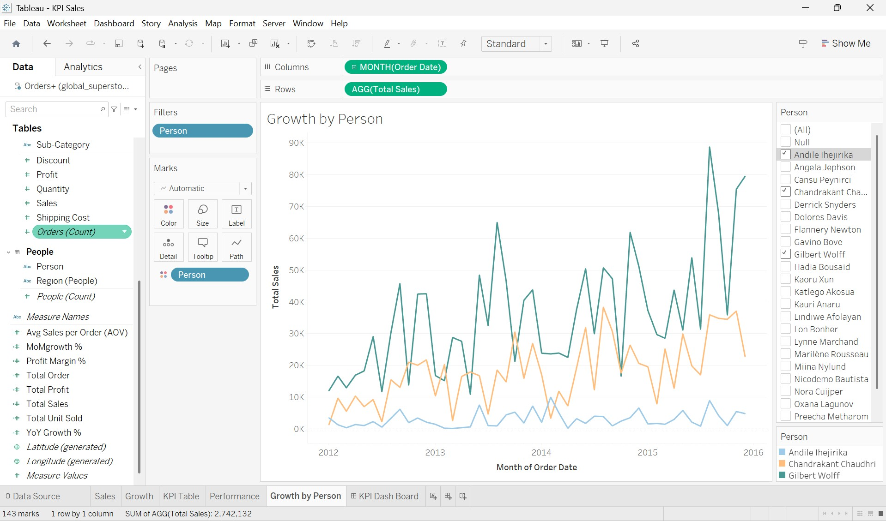

# 📊 Salesperson KPI Dashboard (Power BI & Tableau)

## 📌 Project Overview
This project presents a **Salesperson (Employee) KPI Dashboard** developed using **Power BI** and **Tableau**.  
The dashboards analyze individual sales performance, profitability, product contribution, and growth trends over time using the **Global Superstore** dataset.

The objective of this project is to demonstrate:
- Business-focused KPI design
- Analytical thinking and KPI modeling
- Time intelligence (MoM / YoY)
- Cross-tool BI capability (**Power BI + Tableau**)
- Clean, recruiter-ready project documentation

---

## 🎯 Business Objectives
The dashboards answer the following key business questions:
- How much did each salesperson sell?
- How much profit did each salesperson generate?
- How many units did they sell?
- Which products and categories did they sell the most?
- How is performance changing Month-over-Month (MoM) and Year-over-Year (YoY)?

---

## 📈 Key KPIs Implemented
- **Total Sales**
- **Total Profit**
- **Total Units Sold**
- **Total Orders**
- **Profit Margin (%)**
- **Average Sales per Order (AOV)**
- **Month-over-Month (MoM) Sales Growth**
- **Year-over-Year (YoY) Sales Growth**

---

## 🛠 Tools & Technologies

### Power BI
- Power BI Desktop
- DAX measures
- KPI Cards and Matrix visuals
- Interactive slicers (Salesperson, Year, Month)
- Time intelligence using DAX (MoM & YoY)

### Tableau
- Tableau Desktop / Tableau Public
- Calculated Fields
- KPI Tables
- Table Calculations for MoM & YoY
- Interactive dashboards and filters

### Dataset
- Global Superstore dataset (public retail dataset for learning and portfolio projects)

---

## 📂 Repository Structure
> **Note:** Files are organized inside a parent folder named `Sales_KPI_Project`.

---

## 🔵 Power BI Dashboard Pages

### 1️⃣ Employee KPI Dashboard
- KPI Cards: Sales, Profit, Units, Margin, Orders, AOV
- Salesperson KPI matrix (sortable)
- Interactive slicers (Person, Year, Month)

### 2️⃣ Product Performance by Employee
- Top products by Sales
- Top products by Units Sold
- Category and Sub-category analysis

### 3️⃣ Sales Growth by Salesperson
- Monthly Sales Trend
- Monthly Profit Trend
- MoM and YoY analysis

📁 **Power BI file:**  
`Sales_KPI_Project/01_PowerBI/Sales_KPI_Project.pbix`

---

## 🟠 Tableau Dashboard Components

### Tableau Sheets Created
- **KPI Table** – KPI comparison by salesperson
- **Sales Performance** – Sales and profit by employee
- **Product Analysis** – Top products and categories
- **Growth Analysis** – Monthly sales trends
- **Sales Growth by Salesperson** – Individual performance trends
- **KPI Dashboard** – Combined interactive dashboard

📁 **Tableau workbook:**  
`Sales_KPI_Project/02_Tableau/KPI Sales.twb`

📌 **Note:**  
When opening the Tableau workbook, you may be prompted to locate the data source.  
Select:

---

## 🖼 Screenshots

### Power BI – Employee KPI Dashboard

### Power BI – Product Performance by Employee

### Power BI – Sales Growth by Salesperson

### Tableau – KPI Dashboard

### Tableau – Additional Views

---

## ▶ How to Open the Files

### 🔵 Power BI
1. Download `Sales_KPI_Project/01_PowerBI/Sales_KPI_Project.pbix`
2. Open using **Power BI Desktop**
3. Refresh data if prompted

### 🟠 Tableau
1. Download `Sales_KPI_Project/02_Tableau/KPI Sales.twb`
2. Open in **Tableau Desktop or Tableau Public**
3. If prompted, reselect:
   `Sales_KPI_Project/03_Data/global_superstore_2016.xlsx`

---

## ✅ Key Learnings
- Designed a salesperson performance KPI framework
- Built MoM and YoY growth metrics
- Implemented the same business logic in Power BI and Tableau
- Created a clean, professional GitHub portfolio project

---

## ⚠ Disclaimer
- Dataset is public and used strictly for learning and portfolio purposes
- Salesperson names are used only for analytical demonstration

---

## 📬 Contact
**Tonmoy Barua**  
Business Analytics | Power BI | Tableau  
United States  

⭐ If you find this project useful, feel free to star the repository or connect on LinkedIn.
